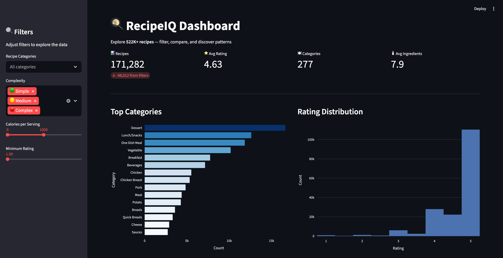
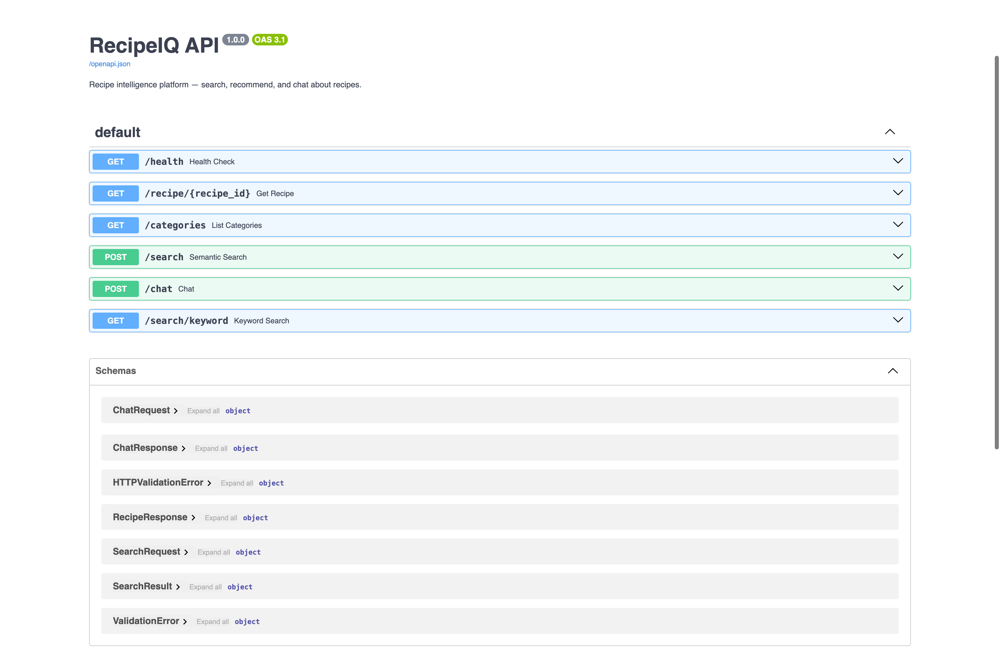
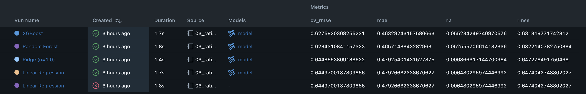

# RecipeIQ

An end-to-end food intelligence platform I built to take a dataset from raw CSVs all the way to a deployed AI chatbot. It works with 522K+ recipes and 1.4M+ reviews from Food.com, and covers everything from data cleaning to serving predictions through a REST API.

I structured the project around four stages, each one simulating a different role on a data team — because I wanted to show I can do more than just train a model in a notebook.

| Stage | Role | What I Built |
|-------|------|-------------|
| 1 | Data Engineer | ETL pipeline → DuckDB warehouse |
| 2 | Data Analyst | SQL analysis + Streamlit dashboard |
| 3 | Data Scientist | Rating predictor, recommender, clustering |
| 4 | AI Engineer | Sentiment analysis, RAG chatbot, REST API |

---

## Why I Built This

I wanted a portfolio project that actually reflects what working with data looks like in practice — messy data, memory constraints, design tradeoffs. Not just a clean Kaggle notebook. Every stage here taught me something I wouldn't have learned from a tutorial.

---

## Screenshots

### Streamlit Dashboard


### FastAPI Documentation


### MLflow Experiment Tracking


---

## What's Inside

### Data Pipeline (`src/pipeline/`)

The ETL pipeline reads raw recipe and review CSVs, deals with real-world messiness (HTML entities in recipe names, missing nutrition values, inconsistent formats), engineers features like per-serving nutrition and ingredient counts, and loads everything into DuckDB. I made it idempotent so I can re-run it without worrying about duplicates.

### Dashboard (`src/dashboard/`)

A Streamlit dashboard for exploring the dataset — filter by category, rating range, nutrition, view distribution charts, and compare recipe groups. Honestly one of the more satisfying parts to build because you can actually *see* the data come alive.

```bash
uv run streamlit run src/dashboard/app.py
```

### ML Models (`src/models/`)

I trained three types of models, all tracked with MLflow:

- **Rating Predictor** — tried Linear Regression, Ridge, Random Forest, and XGBoost. XGBoost won, as it usually does for tabular data.
- **Recipe Recommender** — I went with a dual approach: content-based filtering using TF-IDF on recipe descriptions, plus collaborative filtering from the user-item review matrix. Had to limit collab filtering to the top 20K most-reviewed recipes because the full similarity matrix would've eaten all 24GB of my RAM.
- **Nutrition Clustering** — K-Means on 6 nutritional features. Ended up with 5 clusters (ultra-light, moderate, protein-heavy, etc.) based on elbow method + silhouette scores, then used PCA to visualize them.

### AI Components (`src/ai/`)

This is where it gets fun:

- **Sentiment Analysis** — TF-IDF + Logistic Regression to classify review sentiment. Had to use balanced class weights because ~85% of reviews are positive (people mostly review recipes they like).
- **Embeddings** — used the Gemini Embedding API to vectorize 50K recipes (combining name, category, description, and nutrition info), stored in a local ChromaDB instance. Semantic search actually works really well — "quick healthy chicken dinner" returns relevant results even without exact keyword matches.
- **RAG Pipeline** — retrieves relevant recipes from the vector store, stuffs them into the prompt as context, and lets Gemini generate an answer. It's grounded in real data so it won't hallucinate recipes that don't exist.
- **Chatbot** — conversational wrapper around the RAG pipeline. Maintains chat history and accumulates recipe context across turns, so you can ask follow-up questions.

### REST API (`src/api/`)

FastAPI serving everything over HTTP:

| Endpoint | Method | What it does |
|----------|--------|-------------|
| `/health` | GET | Health check |
| `/recipe/{id}` | GET | Fetch a recipe with nutrition info |
| `/categories` | GET | All 311 categories with counts and avg ratings |
| `/search/keyword` | GET | Simple keyword search by name |
| `/search` | POST | Semantic search via Gemini embeddings |
| `/chat` | POST | Conversational Q&A with session memory |

```bash
uv run uvicorn src.api.main:app --reload --port 8000
# Swagger docs at http://localhost:8000/docs
```

---

## Project Structure

```
RecipeIQ/
├── data/
│   ├── raw/                    # Original CSVs (not in git)
│   ├── processed/
│   │   └── recipeiq.duckdb     # Analytical warehouse
│   └── vectors/
│       └── chroma_db/          # Recipe embeddings
├── src/
│   ├── pipeline/               # ETL: extract, clean, features, load
│   ├── models/                 # ML: features, recommender, clustering
│   ├── ai/                     # NLP: sentiment, embeddings, rag, chatbot
│   ├── api/                    # FastAPI app
│   └── dashboard/              # Streamlit dashboard
├── notebooks/
│   ├── 00_data_exploration.ipynb
│   ├── 01_sql_analysis.ipynb
│   ├── 02_visualizations.ipynb
│   ├── 03_rating_model.ipynb
│   ├── 04_recommender.ipynb
│   ├── 05_clustering.ipynb
│   └── 06_sentiment.ipynb
├── models/                     # Saved .joblib artifacts
├── Docs/                       # Build guides and analysis report
├── dockerfile
├── docker-compose.yml
└── pyproject.toml
```

---

## Tech Stack

| Category | Tools |
|----------|-------|
| Language | Python 3.12, managed with [uv](https://docs.astral.sh/uv/) |
| Data | Pandas, NumPy, DuckDB, PyArrow |
| Viz | Plotly, Seaborn, Matplotlib, Streamlit |
| ML | scikit-learn, XGBoost, MLflow |
| NLP / AI | NLTK, Gemini API (embeddings + generation), ChromaDB |
| API | FastAPI, Uvicorn |
| Infra | Docker, docker-compose |

---

## Getting Started

**Prerequisites:** Python 3.12, [uv](https://docs.astral.sh/uv/), and a [Gemini API key](https://aistudio.google.com/apikey) (free tier is fine).

```bash
# Clone and install
git clone https://github.com/yourusername/RecipeIQ.git
cd RecipeIQ
uv sync

# Add your API key
echo "GEMINI_API_KEY=your_key_here" > .env

# Run the ETL pipeline (put raw CSVs in data/raw/ first)
uv run python -m src.pipeline.load
```

### Run Services

```bash
# Dashboard
uv run streamlit run src/dashboard/app.py

# API server
uv run uvicorn src.api.main:app --reload --port 8000

# MLflow experiment tracker
uv run mlflow ui --host 127.0.0.1 --allowed-hosts "127.0.0.1:*,localhost:*"

# Build the vector store (one-time, ~5 min)
uv run python -m src.ai.embeddings build

# Try the RAG pipeline
uv run python -m src.ai.rag "What's a good high-protein breakfast?"

# Interactive chatbot
uv run python -m src.ai.chatbot
```

### Docker

```bash
docker compose up --build
# API at http://localhost:8000
```

---

## Data

The dataset is from [Food.com Recipes and Reviews on Kaggle](https://www.kaggle.com/datasets/irkaal/foodcom-recipes-and-reviews):

- **522,517 recipes** — names, categories, descriptions, nutrition, ingredients
- **1,401,768 reviews** — ratings and review text
- **311 categories** — from Appetizers to Yeast Breads

Everything lives in a single DuckDB file after ETL. Raw CSVs aren't tracked in git.

---

## Notebooks

Each notebook imports from the corresponding `src/` module — notebooks handle visualization and exploration, modules contain the reusable code. They're meant to be run in order.

| # | Stage | What it covers |
|---|-------|---------------|
| 00 | 1 | Data profiling, missing values, distributions |
| 01 | 2 | SQL analytics against DuckDB |
| 02 | 2 | Charts for the analysis report |
| 03 | 3 | Training + comparing 4 regression models |
| 04 | 3 | Content-based + collaborative filtering |
| 05 | 3 | K-Means clustering with PCA |
| 06 | 4 | Sentiment classification |

---

## Saved Models

| Model | File | Purpose |
|-------|------|---------|
| Rating Predictor | `rating_predictor.joblib` | Predict recipe ratings |
| TF-IDF Recommender | `recommender_tfidf.joblib` | Content-based similarity |
| K-Means Clusters | `clustering_kmeans.joblib` | Nutritional grouping |
| Sentiment Classifier | `sentiment_classifier.joblib` | Review tone detection |

All experiments tracked in MLflow — `uv run mlflow ui --host 127.0.0.1 --allowed-hosts "127.0.0.1:*,localhost:*"` to browse.

---

## What I Learned

- How to deal with real messy data (HTML entities, nulls, skewed distributions)
- Memory management matters — a naive similarity matrix on 300K recipes would need ~100GB of RAM
- The notebook → module extraction pattern that real teams use
- Building a RAG pipeline that's actually grounded and doesn't hallucinate
- How FastAPI and Streamlit serve different purposes (API for production, dashboard for exploration)
- Experiment tracking with MLflow makes model comparison so much easier

---

## License

Built for learning and portfolio purposes. The Food.com dataset is publicly available on Kaggle.
